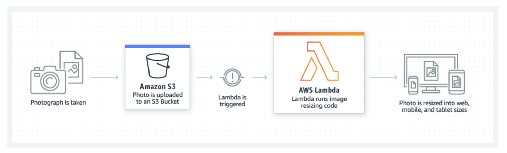
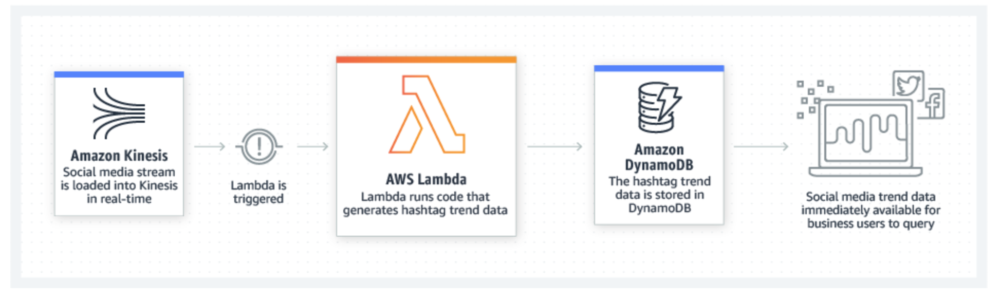
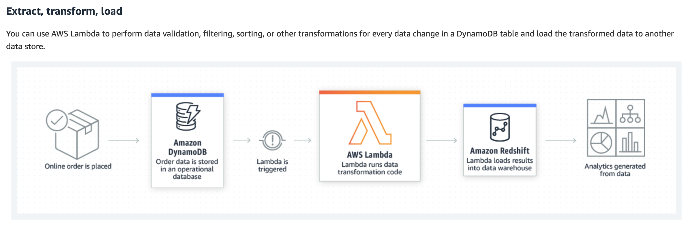

- [DynamoDB](#DynamoDB)
  - [DynamoDB Streams Use Cases and Design Patterns](#DynamoDB-Streams-Use-Cases-and-Design-Patterns)
    - [Relational databases](#Relational-databases)
    - [NoSQL](#NoSQL)
    - [DynamoDB Streams](#DynamoDB-Streams)
    - [DynamoDB Streams Use Cases](#DynamoDB-Streams-Use-Cases)
    - [Enabling a Stream](#Enabling-a-Stream)
    - [DynamoDB + DynamoDB Stream + Lambda + Firehose + S3 Use Case](#DynamoDB--DynamoDB-Stream--Lambda--Firehose--S3-Use-Case)
      - [ETL Solution](#ETL-Solution)
- [AWS S3](#AWS-S3)
- [AWS Andes - Project of Data Lake](#AWS-Andes---Project-of-Data-Lake)
- [Amazon Elastic Block Store EBS](#Amazon-Elastic-Block-Store-EBS)
- [AWS Lambda](#AWS-Lambda)
  - [Lambda Use Cases - Data processing](#Lambda-Use-Cases---Data-processing)
    - [Real-time file processing](#Real-time-file-processing)
      - [Examples](#Examples)
    - [Real-time stream processing](#Real-time-stream-processing)
      - [Examples](#Examples-1)
    - [Extract, transform, load](#Extract-transform-load)
      - [Example](#Example)
  - [Introducing AWS Lambda functions](#Introducing-AWS-Lambda-functions)
- [AWS Kinesis Data Firehose](#AWS-Kinesis-Data-Firehose)
  - [Kinesis Data Firehose - Data Flow](#Kinesis-Data-Firehose---Data-Flow)

***

# DynamoDB

## DynamoDB Streams Use Cases and Design Patterns

- How do you set up a relationship across multiple tables in which, based on the value of an item from one table, you update the item in a second table?

- How do you trigger an event based on a particular transaction?

- How do you audit or archive transactions?

- How do you replicate data across multiple tables (similar to that of materialized views/streams/replication in relational data stores)?

### Relational databases

- Relational databases provide native support for transactions, triggers, auditing, and replication. 
  
- Typically, a transaction in a database refers to performing create, read, update, and delete (CRUD) operations against multiple tables in a block. 
  
- A transaction can have only two states—success or failure. In other words, there is no partial completion.

### NoSQL

- As a NoSQL database, DynamoDB `is not designed to support transactions`. 

- Although client-side libraries are available to mimic the transaction capabilities, they are not scalable and cost-effective. 

- For example, the Java Transaction Library for DynamoDB creates 7N+4 additional writes for every write operation. This is partly because the library holds metadata to manage the transactions to ensure that it’s consistent and can be rolled back before commit.

---

### DynamoDB Streams

- DynamoDB Streams is a powerful service that you can combine with other AWS services to solve many similar problems. 
  
- When enabled, DynamoDB Streams captures a time-ordered sequence of item-level modifications in a DynamoDB table and durably stores the information for up to 24 hours. 
  
- Applications can access a series of stream records, which contain an item change, from a DynamoDB stream in `near real time`.

- AWS maintains `separate endpoints for DynamoDB and DynamoDB Streams`. 

- To work with database tables and indexes, your application must access a DynamoDB endpoint. 

- To read and process DynamoDB Streams records, your application must `access a DynamoDB Streams endpoint in the same Region`.

---

### DynamoDB Streams Use Cases

An application in one AWS region modifies the data in a DynamoDB table. A second application in another AWS region reads these data modifications and writes the data to another table, creating a replica that stays in sync with the original table.

A popular mobile app modifies data in a DynamoDB table, at the rate of thousands of updates per second. Another application captures and stores data about these updates, providing near real time usage metrics for the mobile app.

A global multi-player game has a multi-master topology, storing data in multiple AWS regions. Each master stays in sync by consuming and replaying the changes that occur in the remote regions.

An application automatically sends notifications to the mobile devices of all friends in a group as soon as one friend uploads a new picture.

A new customer adds data to a DynamoDB table. This event invokes another application that sends a welcome email to the new customer.

---

### Enabling a Stream

- You can enable a stream on a new table when you create it. 
  
- You can also enable or disable a stream on an existing table, or change the settings of a stream. 

- DynamoDB Streams operates asynchronously, so there is no performance impact on a table if you enable a stream.

---

### DynamoDB + DynamoDB Stream + Lambda + Firehose + S3 Use Case

`Use case`: Suppose that there is a business requirement to store all the invoice transactions for up to 7 years for compliance or audit requirements. Also, the users should be able to run ad hoc queries on this data.

#### ETL Solution

1. DynamoDB is ideal for storing real-time (hot) data that is frequently accessed. 

2. After a while, depending on a use case, the data isn’t hot any more, and it’s typically archived in storage systems like Amazon S3. 
   
3. You can design a solution for this using Amazon Kinesis Firehose and S3. 

> Use Lambda or a KCL application to read the DynamoDB stream, and write the data using Kinesis Firehose by calling the `PutRecord` or `PutRecordBatch` 
   
4. Kinesis Firehose is a managed service that you can use to load the stream data into Amazon S3, Amazon Redshift, or Amazon Elasticsearch Service through simple API calls. 

> Amazon Kinesis Firehose batches the data and stores it in S3 based on either buffer size (1–128 MB) or buffer interval (60–900 seconds). The criterion that is met first `triggers the data delivery to Amazon S3`.

5. It can also batch, compress, and encrypt the data before loading it, which minimizes the amount of storage used at the destination and increases security.

***

# AWS S3

Amazon Simple Storage Service (Amazon S3) is an object storage service that offers industry-leading scalability, data availability, security, and performance. 

This means customers of all sizes and industries can use it to store and protect any amount of data for a range of use cases, such as websites, mobile applications, backup and restore, archive, enterprise applications, IoT devices, and big data analytics. 

Amazon S3 provides easy-to-use management features so you can organize your data and configure finely-tuned access controls to meet your specific business, organizational, and compliance requirements. 

Amazon S3 is designed for 99.999999999% (11 9's) of durability, and stores data for millions of applications for companies all around the world.

***

# AWS Andes - Project of Data Lake

***

# Amazon Elastic Block Store EBS

***

# AWS Lambda

- AWS Lambda lets you run code without provisioning or managing servers. You pay only for the compute time you consume - there is no charge when your code is not running.

- With Lambda, you can run code for virtually any type of application or backend service - all with zero administration. Just upload your code and Lambda takes care of everything required to run and scale your code with high availability. You can set up your code to automatically trigger from other AWS services or call it directly from any web or mobile app.

---

## Lambda Use Cases - Data processing

 
### Real-time file processing

You can use Amazon S3 to trigger AWS Lambda to process data `immediately after an upload`. For example, you can use Lambda to thumbnail images, transcode videos, index files, process logs, validate content, and aggregate and filter data in real-time.

#### Examples

- The Seattle Times uses AWS Lambda to resize images for viewing on different devices such as desktop computers, tablets, and smartphones.

- Square Enix's corporate philosophy is to spread happiness across the globe by providing unforgettable experiences. The company provides high-quality entertainment content, services, and products. Its flagship video-game titles include Dragon Quest, Final Fantasy, and Tomb Raider.

### Real-time stream processing

You can use AWS Lambda and Amazon Kinesis to process real-time streaming data for application activity tracking, transaction order processing, click stream analysis, data cleansing, metrics generation, log filtering, indexing, social media analysis, and IoT device data telemetry and metering.

#### Examples

- Localytics processes billions of data points in real-time, and uses Lambda to process historical and live data stored in S3 or streamed from Kinesis.

### Extract, transform, load

You can use AWS Lambda to perform data validation, filtering, sorting, or other transformations for every data change in a DynamoDB table and load the transformed data to another data store.

#### Example

Zillow uses Lambda and Kinesis to track a subset of mobile metrics in realtime. With Kinesis and Lambda, we were able to develop and deploy a cost effective solution in two weeks.

---

## Introducing AWS Lambda functions

- The code you run on AWS Lambda is called a “Lambda function.” 

- After you create your Lambda function it is always ready to run as soon as it is `triggered`, similar to a formula in a spreadsheet. 
  
- Each function includes your code as well as some associated configuration information, including the `function name` and `resource requirements`. 
  
- Lambda functions are `“stateless`,” with no affinity to the underlying infrastructure, so that Lambda can rapidly launch as many copies of the function as needed to scale to the rate of incoming events.

- After you upload your code to AWS Lambda, you can associate your function with specific AWS resources (e.g. a particular Amazon S3 bucket, Amazon DynamoDB table, Amazon Kinesis stream, or Amazon SNS notification). 
  
- Then, when the resource changes, Lambda will execute your function and manage the compute resources as needed in order to keep up with incoming requests.

***

# AWS Kinesis Data Firehose

- Amazon Kinesis Data Firehose is the easiest way to reliably load streaming data into data lakes, data stores and analytics tools. 

- It can capture, transform, and load streaming data into Amazon S3, Amazon Redshift, Amazon Elasticsearch Service, and Splunk, enabling near real-time analytics with existing business intelligence tools and dashboards you’re already using today. 

- It is a fully managed service that automatically scales to match the throughput of your data and requires no ongoing administration. 
  
- It can also batch, compress, transform, and encrypt the data before loading it, minimizing the amount of storage used at the destination and increasing security.

- You can easily create a Firehose delivery stream from the AWS Management Console, configure it with a few clicks, and start sending data to the stream from hundreds of thousands of data sources to be loaded continuously to AWS – all in just a few minutes. 

- You can also configure your delivery stream to automatically convert the incoming data to columnar formats like Apache Parquet and Apache ORC, before the data is delivered to Amazon S3, for cost-effective storage and analytics.

- With Kinesis Data Firehose, you only pay for the amount of data you transmit through the service, and if applicable, for data format conversion. There is no minimum fee or setup cost.

---

## Kinesis Data Firehose - Data Flow

- For Amazon S3 destinations, streaming data is delivered to your S3 bucket. If data transformation is enabled, you can optionally `back up source data` to another Amazon S3 bucket.

- For Amazon Redshift destinations, streaming data is `delivered to your S3 bucket first`. Kinesis Data Firehose then issues an Amazon Redshift COPY command to load data from your S3 bucket to your Amazon Redshift cluster. If data transformation is enabled, you can optionally back up source data to another Amazon S3 bucket.

- For Amazon ES destinations, streaming data is delivered to your Amazon ES cluster, and it can optionally be backed up to your S3 bucket concurrently.

- For Splunk destinations, streaming data is delivered to Splunk, and it can optionally be backed up to your S3 bucket concurrently.

---

***